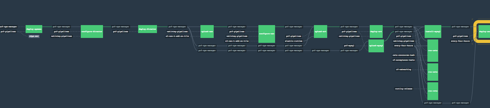

# nsx-t-ci-pipeline

Install Concourse and Pivotal PAS/PCF 2.0 with VMware NSX-T (Add-on) Tile for PCF.
NOTE: The tool and scripts don't install the full VMware NSX-T or automate creation of NSX-T Routers or Logical switches.

The tools in this repo only help in automating the install of [Concourse](http://concourse.ci/), followed by install of [Pivotal Ops Mr and PCF/PAS](https://network.pivotal.io) on [VMware NSX-T](https://docs.vmware.com/en/VMware-NSX-T/index.html) managed network infrastructure. The Pivotal Cloud Foundry or Application service (PAS) would use NSX-T for the CNI implementation, instead of the default Silk as CNI.



## Installing Concourse

Edit the scripts and templates under Concourse to setup a BOSH Director and use that to deploy Concourse.
This concourse install would be used later to install Pivotal Ops Mgr 2.0, NSX-T Add-on Tile and Pivotal Application Service Tiles. 

### Bringing up Bosh Director
* Edit the concourse/bosh/vsphere-config.yml and concourse/bosh/vsphere/cloud-config.yml
* Run ```source scripts/setup.sh; cd concourse/bosh; ./bosh-create-env.sh```
* Now the bosh director should have come up (if the configurations are correct)

### Bringing up Concourse
* Edit the concourse/concourse-manifest.yml and concourse/concourse-params.yml
* Use github membership to handle auth to concourse. This requires generating github team and associated client id & keys.
** Refer to https://docs.pivotal.io/p-concourse/authenticating.html#authorize-github for more details
* Run ```source scripts/setup.sh; cd concourse; ./deploy.sh```
* Now the Concourse should have come up (if the configurations are correct)

## Prerequisites for Tile Install
* There needs to be a T0 Router that has a tag scope `ncp/cluster` and a value that can be used for Cloud Foundry install. The value (sample value of `ncp/cluster` scoped tag is `pcf2.0` on a given T0Router) should match with the foundation name specified for the NSX-T Tile configuration. Same for the overlay network, container ip pools, external mapped ip pools etc.
* There needs to be minimum of 2 networks (logical switches) in NSX-T - one for BOSH & Ops Mgr (named infra) and one for PAS (named ert). The names need not match exactly, just ensure the params file is correctly specifying the logical switch names.
  * Sample setup
 
  | Logical Switch | Sample Subnet | Sample Static ips           | Description                 |
  | -------------- |:-------------:|:---------------------------:|:----------------------------|
  | infra          |192.168.10.0/26|192.168.10.5|used by Ops Mgr|
  | ert            |192.168.20.0/22|192.168.20.30,192.168.20.31|used by GoRouter|
  |                |               |192.168.20.61,192.168.20.62|used by TCPRouter|
  |                |               |192.168.20.71,192.168.20.72|used by SSH Proxy/Diego Brain|
  | services       |192.168.24.0/22|192.168.24.155|used by RabbitMQ   |
  |                |               |192.168.20.160|used by MySQL Proxy|
  | dynamic-services|192.168.28.0/22|             |                   |
  
* The Ops Mgr should have its own NAT setup configured on the T0 Router. The Ops Mgr domain name gets resolved to an externally resolvable address that is then natted via the T0 Router into the internal address. This can be via BGP or floating ips with static route on the T0 Router. The associated T1 Router should have All NSX Connected routes advertisement enabled.
* The GoRouter should have its own LBR configured on the T1 Router so the app and system domain names gets resolved to an externally resolvable address mapped to the Virtual Server and its LBR is then associated with the appropriate T1 Router (with LBR VIP advertisement enabled).
* If the NSX-T tile is not publicly downloadable from https://network.pivotal.io (as of 01/15/2018), download the [NSX-T Container bits from VMware site](https://my.vmware.com/web/vmware/details?productId=673&downloadGroup=NSX-T-210) and extract the .pivotal tile from the bundle and save it on a Amazon S3 bucket for the Concourse pipeline to use.
  * Make sure the s3 creds and bucket names are correct for pipeline to pull down the nsx-t tile from s3. 
  * If unsure of the region name or if Concourse pipeline reports problems in retreiving the resource from s3, comment off the region_name parameter inside the pipeline and try applying the chagnes again against the pipeline. 

## Installing Pivotal Ops Mgr and Cloud Foundry Deployment

* There are 3 pipeline templates available:
  * Use the install-pcf-pipeline.yml for standard PAS 2.0 install with NSX with 3 AZs, 4 networks (infra, ert, services and dynamics services as specified in the PCF NSX Cookbook arch)
  * Use the install-pcf-pipeline-nsx-t-poc.yml for a limited 3 AZ, 2 networks (infra, ert) install of PAS + NSX-T (as suggested in VMware field guide for NSX-T + PAS POCs)
  * Use the install-pcf-pipeline-scs.yml for the full install of PAS with NSX, MySQL, RabbitMQ and Spring Cloud Service Tiles
* Create a params.yml using the piplines/params.sample.yml as template (under pipelines or other folder)
  * Note: For users using the nsx-t-poc pipeline, use the params.nsx-t-poc.sample.yml as template
* Edit the values for the various tile versions, vcenter endpoints, network segments, creds etc. The pipeline expects 4 different network configs (for Infra, Ert, Services and Dynamic Services) based on PCF reference deployment arch (based on NSX-V, NSX-T yet to come up).
* Edit the setup.sh script (changing the url for the concourse web endpoint, name of the pipeline, path to the params file etc.)
* Run `source setup.sh`
* Run `fly-s` to register the pipeline
* Hit unpause on pipeline in the Concourse UI (referred as the web ui endpoint for concourse) or using ```fly -t <target> unpause-pipeline -p <pipeline-name>```
* Check on progress using `fly ... watch` or `fly-h <build-no>`


### Running Cloud Foundry Acceptance tests
* Register the cf acceptance test pipeline using `fly -t <target> set-pipeline -p cf-acceptance-pipeline -c cf-acceptance-tests-pipeline -l params.yml` to register the acceptance test pipeline
* Hit unpause on pipeline in the Concourse UI (referred as the web ui endpoint for concourse) or using ```fly -t <target> unpause-pipeline -p <pipeline-name>```
* Check on progress using `fly ... watch` or `fly-h <build-no>`


